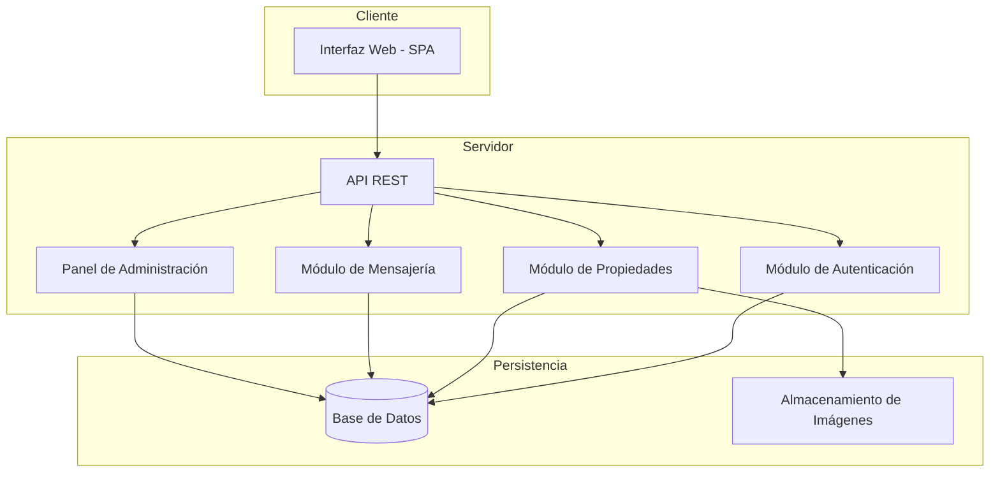
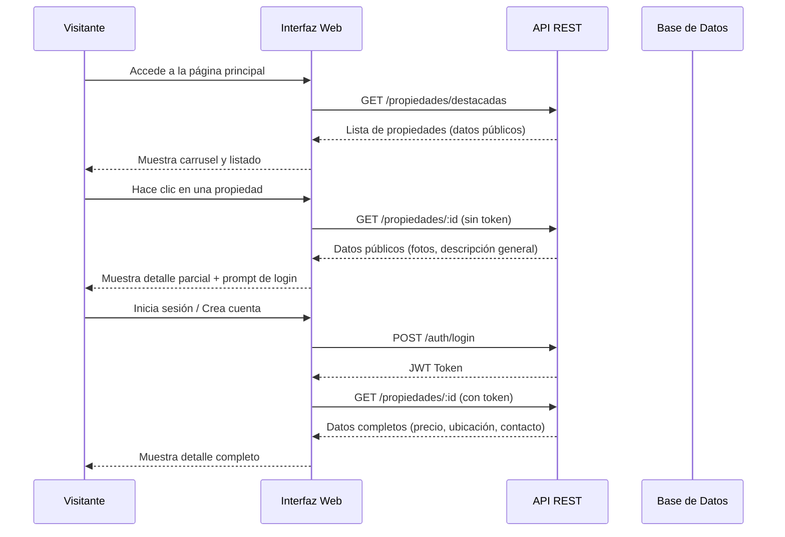
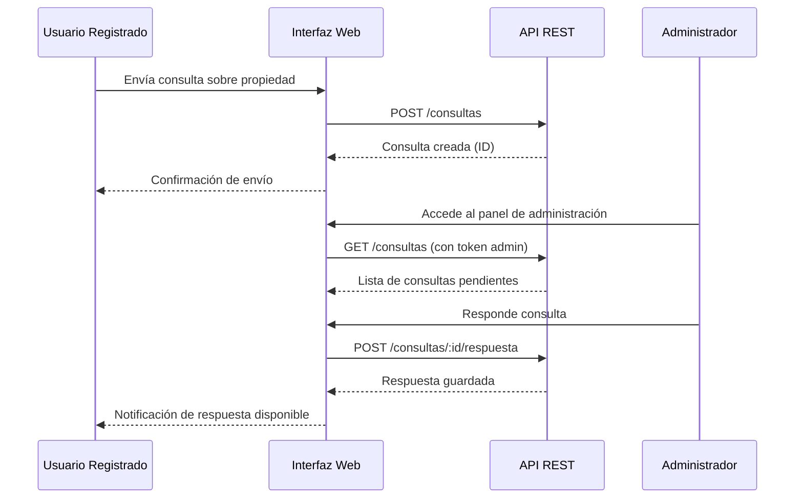

# Documento de Diseño: Plataforma Web Inmobiliaria

## Descripción General

La plataforma web inmobiliaria es una aplicación orientada a la venta y alquiler de propiedades, con foco en la simplicidad visual y la experiencia de usuario. Permite a visitantes explorar propiedades públicamente, mientras que los datos sensibles (ubicación exacta, precio, contacto, consultas) quedan restringidos a usuarios registrados. Incluye un sistema de mensajería interna entre usuarios y el administrador, y un panel de administración completo para gestionar propiedades y consultas.

La plataforma busca diferenciarse por su diseño moderno y limpio, priorizando que el usuario se concentre en las propiedades sin distracciones visuales. El flujo principal es: exploración pública → registro/login → acceso a datos sensibles → consulta al administrador.

---

## Arquitectura



---

## Diagramas de Secuencia

### Flujo: Exploración y acceso a datos sensibles



### Flujo: Consulta al administrador



---

## Componentes e Interfaces

### Componente 1: Módulo de Autenticación

**Propósito**: Gestionar registro, login y control de acceso basado en roles (visitante, usuario, administrador).

**Interfaz**:
```pascal
INTERFACE Autenticacion
  registrar(datos: DatosRegistro): ResultadoAuth
  login(credenciales: Credenciales): ResultadoAuth
  cerrarSesion(token: Token): void
  verificarToken(token: Token): Payload
  esAdministrador(token: Token): boolean
END INTERFACE
```

**Responsabilidades**:
- Validar credenciales y emitir tokens JWT
- Hashear contraseñas antes de persistir
- Controlar acceso según rol del usuario

---

### Componente 2: Módulo de Propiedades

**Propósito**: Gestionar el ciclo de vida de las propiedades, incluyendo creación, edición, publicación y filtrado.

**Interfaz**:
```pascal
INTERFACE Propiedades
  listarDestacadas(): Lista<PropiedadPublica>
  listar(filtros: Filtros): Lista<PropiedadPublica>
  obtenerDetalle(id: UUID, token?: Token): PropiedadDetalle
  crear(datos: DatosPropiedad, token: Token): Propiedad
  actualizar(id: UUID, datos: DatosPropiedad, token: Token): Propiedad
  eliminar(id: UUID, token: Token): void
  marcarDestacada(id: UUID, token: Token): void
END INTERFACE
```

**Responsabilidades**:
- Retornar datos públicos a visitantes y datos completos a usuarios autenticados
- Gestionar imágenes asociadas a cada propiedad
- Aplicar filtros por tipo (venta/alquiler/otros) y estado

---

### Componente 3: Módulo de Mensajería / Consultas

**Propósito**: Permitir la comunicación entre usuarios registrados y el administrador sobre propiedades específicas.

**Interfaz**:
```pascal
INTERFACE Mensajeria
  crearConsulta(datos: DatosConsulta, token: Token): Consulta
  listarConsultasUsuario(token: Token): Lista<Consulta>
  listarTodasConsultas(token: Token): Lista<Consulta>
  responderConsulta(id: UUID, respuesta: String, token: Token): Consulta
  obtenerHilo(consultaId: UUID, token: Token): Lista<Mensaje>
END INTERFACE
```

**Responsabilidades**:
- Asociar consultas a propiedades y usuarios
- Restringir acceso: usuarios ven sus propias consultas, admin ve todas
- Mantener el hilo de conversación ordenado cronológicamente

---

### Componente 4: Panel de Administración

**Propósito**: Proveer al administrador una vista centralizada para gestionar propiedades, usuarios y consultas.

**Interfaz**:
```pascal
INTERFACE PanelAdmin
  obtenerResumen(): ResumenAdmin
  gestionarPropiedades(): Lista<Propiedad>
  gestionarUsuarios(): Lista<Usuario>
  gestionarConsultas(): Lista<Consulta>
END INTERFACE
```

**Responsabilidades**:
- Acceso exclusivo para usuarios con rol `administrador`
- Permitir CRUD completo de propiedades
- Visualizar y responder consultas de usuarios

---

## Modelos de Datos

### Usuario

```pascal
ESTRUCTURA Usuario
  id: UUID
  nombre: String
  email: String
  password_hash: String
  rol: Enum(visitante, usuario, administrador)
  fecha_registro: DateTime
  activo: Boolean
END ESTRUCTURA
```

**Reglas de validación**:
- `email` debe ser único y tener formato válido
- `password` mínimo 8 caracteres antes de hashear
- `rol` por defecto es `usuario` al registrarse

---

### Propiedad

```pascal
ESTRUCTURA Propiedad
  id: UUID
  titulo: String
  descripcion_publica: String
  descripcion_privada: String
  tipo: Enum(venta, alquiler, otro)
  precio: Decimal          -- solo visible para usuarios autenticados
  ubicacion: String        -- solo visible para usuarios autenticados
  contacto: String         -- solo visible para usuarios autenticados
  imagenes: Lista<URL>
  destacada: Boolean
  activa: Boolean
  fecha_publicacion: DateTime
  administrador_id: UUID
END ESTRUCTURA
```

**Reglas de validación**:
- `titulo` no puede estar vacío
- `precio` debe ser mayor a 0
- Al menos una imagen requerida para publicar

---

### Consulta / Mensaje

```pascal
ESTRUCTURA Consulta
  id: UUID
  propiedad_id: UUID
  usuario_id: UUID
  asunto: String
  estado: Enum(pendiente, respondida, cerrada)
  fecha_creacion: DateTime
  mensajes: Lista<Mensaje>
END ESTRUCTURA

ESTRUCTURA Mensaje
  id: UUID
  consulta_id: UUID
  autor_id: UUID
  contenido: String
  fecha: DateTime
END ESTRUCTURA
```

---

## Diseño de Interfaz de Usuario

### Estructura de la Página Principal

```
┌─────────────────────────────────────────────────────┐
│  [LOGO EMPRESA - centrado]          [Login] [Registro]│  ← Encabezado
├─────────────────────────────────────────────────────┤
│                                                       │
│         CARRUSEL DE PROPIEDADES DESTACADAS            │  ← Auto-scroll + manual
│         [◀]  Imagen + Título + Tipo  [▶]             │
│                                                       │
├─────────────────────────────────────────────────────┤
│   [Ver todo]  [Comprar]  [Alquilar]  [Otros]         │  ← Menú de filtros
├─────────────────────────────────────────────────────┤
│                                                       │
│  [Tarjeta]  [Tarjeta]  [Tarjeta]  [Tarjeta]          │
│  [Tarjeta]  [Tarjeta]  [Tarjeta]  [Tarjeta]          │  ← Grilla de propiedades
│                                                       │
├─────────────────────────────────────────────────────┤
│  [LOGO]  Mail: info@empresa.com  Tel: +54 ...         │
│  Política de Privacidad                               │  ← Pie de página
└─────────────────────────────────────────────────────┘
```

### Tarjeta de Propiedad (vista pública)

```
┌──────────────────────┐
│   [Imagen principal] │
│  Tipo: Venta/Alquiler│
│  Título de propiedad │
│  Descripción breve   │
│  [Ver más →]         │  ← Requiere login para datos sensibles
└──────────────────────┘
```

---

## Pseudocódigo Algorítmico

### Algoritmo Principal: Obtener Detalle de Propiedad

```pascal
PROCEDURE obtenerDetallePropiedad(id, token)
  INPUT: id (UUID), token (opcional)
  OUTPUT: PropiedadDetalle

  SEQUENCE
    propiedad ← baseDatos.buscarPropiedad(id)

    IF propiedad ES NULL THEN
      RETURN Error("Propiedad no encontrada", 404)
    END IF

    IF propiedad.activa ES false THEN
      RETURN Error("Propiedad no disponible", 403)
    END IF

    datosPublicos ← {
      id: propiedad.id,
      titulo: propiedad.titulo,
      descripcion_publica: propiedad.descripcion_publica,
      tipo: propiedad.tipo,
      imagenes: propiedad.imagenes
    }

    IF token ES NULL THEN
      RETURN datosPublicos
    END IF

    payload ← auth.verificarToken(token)

    IF payload ES INVALIDO THEN
      RETURN datosPublicos
    END IF

    datosSensibles ← {
      precio: propiedad.precio,
      ubicacion: propiedad.ubicacion,
      contacto: propiedad.contacto,
      descripcion_privada: propiedad.descripcion_privada
    }

    RETURN UNION(datosPublicos, datosSensibles)
  END SEQUENCE
END PROCEDURE
```

**Precondiciones:**
- `id` es un UUID válido
- `token` puede ser nulo (visitante) o un JWT válido

**Postcondiciones:**
- Si no hay token: retorna solo datos públicos
- Si hay token válido: retorna datos completos
- Si la propiedad no existe: retorna error 404

---

### Algoritmo: Autenticación de Usuario

```pascal
PROCEDURE autenticarUsuario(email, password)
  INPUT: email (String), password (String)
  OUTPUT: ResultadoAuth

  SEQUENCE
    IF email ES VACIO O password ES VACIO THEN
      RETURN Error("Credenciales incompletas")
    END IF

    usuario ← baseDatos.buscarPorEmail(email)

    IF usuario ES NULL THEN
      RETURN Error("Usuario no encontrado")
    END IF

    IF usuario.activo ES false THEN
      RETURN Error("Cuenta desactivada")
    END IF

    hashIngresado ← crypto.hash(password)

    IF hashIngresado NO IGUAL A usuario.password_hash THEN
      RETURN Error("Contraseña incorrecta")
    END IF

    payload ← {
      id: usuario.id,
      email: usuario.email,
      rol: usuario.rol
    }

    token ← jwt.firmar(payload, CLAVE_SECRETA, expiracion: "7d")

    RETURN { token: token, usuario: payload }
  END SEQUENCE
END PROCEDURE
```

**Precondiciones:**
- `email` tiene formato válido
- `password` no está vacío

**Postcondiciones:**
- Si credenciales correctas: retorna JWT firmado con datos del usuario
- Si credenciales incorrectas: retorna error descriptivo sin revelar cuál campo falló (seguridad)

**Invariante de seguridad:**
- Nunca se retorna el `password_hash` en la respuesta

---

### Algoritmo: Crear Consulta

```pascal
PROCEDURE crearConsulta(datos, token)
  INPUT: datos (DatosConsulta), token (Token)
  OUTPUT: Consulta

  SEQUENCE
    payload ← auth.verificarToken(token)

    IF payload ES INVALIDO THEN
      RETURN Error("No autorizado", 401)
    END IF

    propiedad ← baseDatos.buscarPropiedad(datos.propiedad_id)

    IF propiedad ES NULL O propiedad.activa ES false THEN
      RETURN Error("Propiedad no válida", 404)
    END IF

    IF datos.asunto ES VACIO O datos.mensaje ES VACIO THEN
      RETURN Error("Asunto y mensaje son requeridos")
    END IF

    consulta ← {
      id: generarUUID(),
      propiedad_id: datos.propiedad_id,
      usuario_id: payload.id,
      asunto: datos.asunto,
      estado: "pendiente",
      fecha_creacion: ahora(),
      mensajes: [
        {
          id: generarUUID(),
          autor_id: payload.id,
          contenido: datos.mensaje,
          fecha: ahora()
        }
      ]
    }

    baseDatos.guardar(consulta)

    RETURN consulta
  END SEQUENCE
END PROCEDURE
```

**Precondiciones:**
- Token válido de usuario autenticado
- `propiedad_id` corresponde a una propiedad activa

**Postcondiciones:**
- Consulta creada con estado `pendiente`
- Primer mensaje incluido en el hilo
- Administrador puede ver la consulta en su panel

---

### Algoritmo: Listar Propiedades con Filtros

```pascal
PROCEDURE listarPropiedades(filtros)
  INPUT: filtros (tipo?: String, pagina?: Int, porPagina?: Int)
  OUTPUT: Lista<PropiedadPublica>

  SEQUENCE
    pagina ← SI filtros.pagina ES NULL ENTONCES 1 SINO filtros.pagina
    porPagina ← SI filtros.porPagina ES NULL ENTONCES 12 SINO filtros.porPagina
    offset ← (pagina - 1) * porPagina

    query ← baseDatos.propiedades.donde(activa = true)

    IF filtros.tipo NO ES NULL Y filtros.tipo NO ES "todo" THEN
      query ← query.donde(tipo = filtros.tipo)
    END IF

    query ← query.ordenarPor(fecha_publicacion, DESC)
    query ← query.limite(porPagina).offset(offset)

    resultados ← query.ejecutar()

    propiedadesPublicas ← []
    FOR EACH propiedad EN resultados DO
      propiedadesPublicas.agregar({
        id: propiedad.id,
        titulo: propiedad.titulo,
        descripcion_publica: propiedad.descripcion_publica,
        tipo: propiedad.tipo,
        imagenes: propiedad.imagenes,
        destacada: propiedad.destacada
      })
    END FOR

    RETURN propiedadesPublicas
  END SEQUENCE
END PROCEDURE
```

**Precondiciones:**
- `tipo` es uno de: `todo`, `venta`, `alquiler`, `otro` (o nulo)
- `pagina` y `porPagina` son enteros positivos si se proveen

**Postcondiciones:**
- Solo se retornan propiedades con `activa = true`
- Datos sensibles nunca incluidos en el listado
- Resultados paginados y ordenados por fecha descendente

**Invariante de bucle:**
- Cada propiedad procesada en el FOR solo expone campos públicos

---

## Manejo de Errores

### Escenario 1: Acceso a datos sensibles sin autenticación

**Condición**: Usuario no autenticado intenta ver precio, ubicación o contacto  
**Respuesta**: Se retornan solo datos públicos; la UI muestra un prompt de login  
**Recuperación**: El usuario puede iniciar sesión y la página recarga los datos completos sin navegar

### Escenario 2: Token expirado o inválido

**Condición**: El JWT enviado está vencido o fue manipulado  
**Respuesta**: API retorna 401; la UI redirige al login y limpia el token local  
**Recuperación**: El usuario vuelve a autenticarse y obtiene un nuevo token

### Escenario 3: Propiedad no encontrada

**Condición**: Se solicita una propiedad con ID inexistente o inactiva  
**Respuesta**: API retorna 404 con mensaje descriptivo  
**Recuperación**: La UI muestra página de error con opción de volver al listado

### Escenario 4: Consulta duplicada

**Condición**: Un usuario intenta crear una segunda consulta abierta sobre la misma propiedad  
**Respuesta**: API retorna 409 indicando que ya existe una consulta activa  
**Recuperación**: La UI redirige al hilo de consulta existente

---

## Estrategia de Testing

### Testing Unitario

Cubrir las funciones críticas de forma aislada:
- `autenticarUsuario`: credenciales válidas, inválidas, cuenta desactivada
- `obtenerDetallePropiedad`: con y sin token, propiedad inexistente
- `crearConsulta`: token válido, token inválido, propiedad inactiva
- `listarPropiedades`: filtros por tipo, paginación, sin resultados

### Testing Basado en Propiedades

**Librería sugerida**: fast-check (JavaScript/TypeScript) o Hypothesis (Python)

Propiedades a verificar:
- Para cualquier propiedad activa, un visitante nunca recibe datos sensibles
- Para cualquier token válido de usuario, los datos sensibles siempre están disponibles
- El listado paginado nunca retorna más elementos que `porPagina`
- Una consulta creada siempre tiene estado inicial `pendiente`

### Testing de Integración

- Flujo completo: registro → login → ver propiedad → crear consulta → respuesta admin
- Flujo de administración: login admin → crear propiedad → marcar destacada → responder consulta
- Verificar que el carrusel solo muestra propiedades con `destacada = true`

---

## Consideraciones de Seguridad

- Contraseñas hasheadas con bcrypt (salt rounds ≥ 12)
- JWT firmado con clave secreta de entorno, expiración de 7 días
- Rutas sensibles protegidas por middleware de autenticación
- Validación de inputs en servidor (no solo en cliente)
- Rate limiting en endpoints de login y registro para prevenir fuerza bruta
- Datos sensibles de propiedades nunca incluidos en respuestas públicas, validado a nivel de API
- Panel de administración accesible solo con rol `administrador` verificado en cada request

---

## Consideraciones de Rendimiento

- Carrusel de destacadas cacheado (TTL corto, ~5 minutos) para reducir consultas frecuentes
- Listado de propiedades paginado (12 por página por defecto)
- Imágenes servidas desde almacenamiento externo (CDN o bucket) con URLs firmadas
- Índices en base de datos sobre: `activa`, `tipo`, `destacada`, `fecha_publicacion`

---

## Dependencias

- Framework web frontend (React / Vue / similar) para SPA
- Framework backend (Node.js/Express, Django, o similar) para API REST
- Base de datos relacional (PostgreSQL recomendado) para persistencia
- Almacenamiento de objetos (S3, Cloudinary, o similar) para imágenes
- Librería JWT para autenticación
- Librería de hashing (bcrypt) para contraseñas
- Librería de validación de esquemas (Zod, Joi, Pydantic, o similar)


---

## Propiedades de Corrección

*Una propiedad es una característica o comportamiento que debe mantenerse verdadero en todas las ejecuciones válidas del sistema — esencialmente, una declaración formal sobre lo que el sistema debe hacer. Las propiedades sirven como puente entre las especificaciones legibles por humanos y las garantías de corrección verificables por máquinas.*

### Propiedad 1: Registro siempre asigna rol usuario

*Para cualquier* conjunto válido de datos de registro (nombre, email con formato válido, contraseña de al menos 8 caracteres), el resultado del registro siempre debe ser una cuenta con rol `usuario` y un token de sesión válido.

**Valida: Requisitos 1.1, 1.6**

---

### Propiedad 2: Contraseñas cortas siempre son rechazadas

*Para cualquier* contraseña de longitud entre 0 y 7 caracteres, el intento de registro siempre debe ser rechazado sin crear la cuenta.

**Valida: Requisito 1.3**

---

### Propiedad 3: Emails inválidos siempre son rechazados

*Para cualquier* string que no tenga formato de email válido, el intento de registro siempre debe ser rechazado.

**Valida: Requisito 1.4**

---

### Propiedad 4: La contraseña nunca se almacena en texto plano

*Para cualquier* usuario registrado, el valor almacenado en el campo de contraseña nunca debe ser igual a la contraseña original ingresada.

**Valida: Requisito 1.5**

---

### Propiedad 5: Login con credenciales válidas siempre retorna token

*Para cualquier* usuario registrado y activo, autenticarse con sus credenciales correctas siempre debe retornar un token JWT válido.

**Valida: Requisito 2.1**

---

### Propiedad 6: Errores de login no revelan campo incorrecto

*Para cualquier* combinación de credenciales incorrectas (email inexistente, contraseña incorrecta, o ambas), el mensaje de error retornado debe ser genérico e idéntico, sin indicar cuál campo falló.

**Valida: Requisito 2.2**

---

### Propiedad 7: Round-trip de token JWT

*Para cualquier* payload de usuario válido, firmar el payload para generar un token y luego verificar ese token debe producir un payload equivalente al original.

**Valida: Requisito 3.1**

---

### Propiedad 8: Tokens inválidos siempre retornan 401

*Para cualquier* string que no sea un token JWT válido y vigente emitido por el sistema, usarlo en una solicitud a una ruta protegida siempre debe retornar un error 401.

**Valida: Requisito 3.2**

---

### Propiedad 9: Rutas de administración rechazan tokens sin rol administrador

*Para cualquier* token válido con rol distinto de `administrador`, cualquier solicitud a una ruta del panel de administración siempre debe retornar un error 403.

**Valida: Requisitos 3.3, 3.4**

---

### Propiedad 10: Listado público nunca expone datos sensibles

*Para cualquier* conjunto de propiedades en la base de datos, el endpoint de listado público nunca debe incluir los campos precio, ubicación, contacto ni descripción privada en ninguna de las propiedades retornadas.

**Valida: Requisitos 4.1, 4.3, 4.4**

---

### Propiedad 11: Listado público solo incluye propiedades activas

*Para cualquier* conjunto de propiedades con distintos estados, el listado público siempre debe contener únicamente propiedades con `activa = true`.

**Valida: Requisito 4.2**

---

### Propiedad 12: Filtro por tipo retorna solo propiedades del tipo solicitado

*Para cualquier* tipo de filtro válido (venta, alquiler, otro) y cualquier conjunto de propiedades activas, todos los resultados retornados deben tener exactamente el tipo solicitado.

**Valida: Requisito 4.5**

---

### Propiedad 13: Paginación nunca excede el límite configurado

*Para cualquier* conjunto de propiedades y cualquier valor de `porPagina`, el número de propiedades retornadas en una página nunca debe exceder `porPagina`, y los resultados deben estar ordenados por `fecha_publicacion` descendente.

**Valida: Requisito 4.6**

---

### Propiedad 14: Usuario autenticado siempre recibe datos sensibles de propiedad activa

*Para cualquier* token JWT válido y cualquier propiedad con `activa = true`, el detalle de la propiedad siempre debe incluir precio, ubicación, contacto y descripción privada.

**Valida: Requisitos 5.1, 5.4**

---

### Propiedad 15: Carrusel solo muestra propiedades destacadas y activas

*Para cualquier* conjunto de propiedades, el carrusel de la página principal solo debe incluir propiedades que tengan simultáneamente `destacada = true` y `activa = true`.

**Valida: Requisito 6.1**

---

### Propiedad 16: Precio inválido siempre es rechazado en creación

*Para cualquier* valor de precio menor o igual a 0, el intento de crear una propiedad siempre debe ser rechazado.

**Valida: Requisito 7.3**

---

### Propiedad 17: Round-trip de actualización de propiedad

*Para cualquier* propiedad existente y cualquier conjunto válido de datos de actualización, aplicar la actualización y luego consultar la propiedad debe retornar los nuevos valores.

**Valida: Requisito 7.5**

---

### Propiedad 18: Eliminación de propiedad la excluye del listado público

*Para cualquier* propiedad activa, eliminarla (marcar como `activa = false`) debe resultar en que no aparezca en ningún listado público ni en el carrusel.

**Valida: Requisitos 7.6, 4.2**

---

### Propiedad 19: Marcar como destacada incluye la propiedad en el carrusel

*Para cualquier* propiedad activa, marcarla como `destacada = true` debe resultar en que aparezca en el listado de propiedades destacadas.

**Valida: Requisito 7.7**

---

### Propiedad 20: Consulta creada siempre tiene estado pendiente

*Para cualquier* consulta válida creada por un usuario autenticado sobre una propiedad activa, el estado inicial de la consulta siempre debe ser `pendiente` y el primer mensaje debe estar incluido en el hilo.

**Valida: Requisito 8.1**

---

### Propiedad 21: Aislamiento de consultas por usuario

*Para cualquier* usuario autenticado, el listado de sus consultas nunca debe incluir consultas creadas por otros usuarios.

**Valida: Requisito 8.5**

---

### Propiedad 22: Administrador ve todas las consultas

*Para cualquier* conjunto de consultas de distintos usuarios, el administrador siempre debe poder ver la totalidad de las consultas en su listado.

**Valida: Requisito 9.1**

---

### Propiedad 23: Responder consulta actualiza estado y agrega mensaje

*Para cualquier* consulta con estado `pendiente`, responderla debe cambiar el estado a `respondida` y el hilo debe contener el nuevo mensaje del administrador.

**Valida: Requisito 9.2**

---

### Propiedad 24: Mensajes del hilo ordenados cronológicamente

*Para cualquier* hilo de consulta con múltiples mensajes, los mensajes retornados siempre deben estar ordenados por fecha de forma ascendente (del más antiguo al más reciente).

**Valida: Requisito 9.4**
